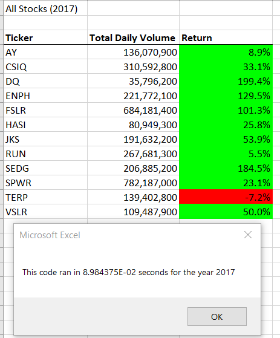
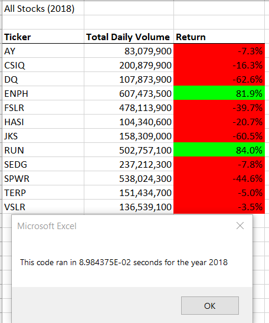

# stock-analysis
Performing an analysis on stock data to uncover trends and to create a refactored macro tool through VBA for the client to use to continue to complete analysis on their own.

## Overview of Project
* Using stock data provided to complete an analysis on specific stocks and to create a refactored macro/tool for the client.

### Purpose
* The purpose of this analysis was to indentify trends of specific stocks for years of 2017 & 2018, these stocks were indentified by the client. The analysis was used to help assess and plan for their future investments.
* The client needed a tool to be able to quickly and effectively assess stocks to indentify trends on their own.

## Analysis
### Analysis of stocks for the year of 2017.
* Overall for the year 2017, stocks were trending positively across the board.
* Tickers "DQ" and "SEDG" had the largest gain in volume.
* Only Ticker "TERP" had a negative performance.

### Analysis of stocks for the year of 2018.
* 2018 overall had a different story with a majority of the stocks trending down.
* However, tickers "RUN" and "ENPH" are still trending upwards making them very attractive.
* As for execution time, both analysis for year of 2017 and 2018 took the same amount of time.
* It's also important to note that the refactored code ran faster than the original code.

## Summary
* Refactored code by restructing existing code without changing the behavior of the code.
* A specific example of refactored code in this VBA script was to a "tickerIndex" variable.
** In creating this "tickerIndex" variable it allowed the macro to run faster because it was was accessing the correct index in four different arrays.

### Advantages of Refactored
* Refactoring removes "Code Smell".
* Makes the code easier to maintain.
* Reduces code size to perform faster.

### Disadvantages of Refactored
* May introduce new bugs that are difficult to troubleshoot.
* Can potentially take more time refactor code.
